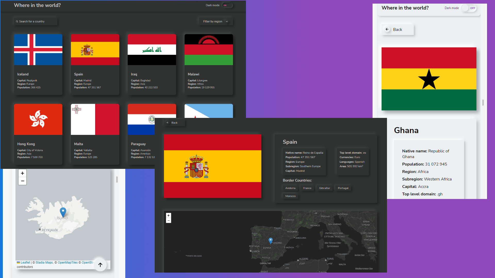

# REST Countries API with neumorphism design and Leaflet Maps

This is my solution to the [REST Countries API with color theme switcher](https://www.frontendmentor.io/challenges/rest-countries-api-with-color-theme-switcher-5cacc469fec04111f7b848ca)

- [Overview](#overview)
  - [The challenge](#the-challenge)
  - [Screenshot](#screenshot)
  - [Links](#links)
- [My process](#my-process)
  - [Built with](#built-with)
  - [What I learned](#what-i-learned)
  - [Continued development](#continued-development)
  - [Useful resources](#useful-resources)
- [Author](#author)
- [Acknowledgments](#acknowledgments)

## Overview

### The challenge

Users should be able to:

- See all countries from the API on the homepage
- See hover states for all interactive elements on the page
- Search countries by name and filter by region
- Click on a country to see more detailed information on a separate page
- Click through to the border countries on the detail page
- Toggle the color scheme between light and dark mode

### Screenshot



### Links

- Solution URL: [GitHub](https://github.com/userMatMik/neo_countries)
- Live Site URL: [Live Site URL](https://idyllic-palmier-bcfd54.netlify.app/)

## My process

### Built with

- SCSS
  - Flexbox
  - CSS Grid
- Vanilla JavaScript
  - JS Routing
  - Async/Await
  - Promise.all()
  - localStorage
- [LeafletJS](https://leafletjs.com/) - JS library for maps

### What I learned

I always wanted to create app in neumorphism design style thats why I didnt follow design prepared by FrontendMentor. So the big part of design is my own, hope you like it :)

That project was great because I could learn and use JS Routing for countries details pages and Promise.all() for geting all borders countries. Also I spend some time on reading Leaflet documentation and for shure I will be using those maps in my future projects.

I also used window.matchMedia() for checking if user use dark mode as his preferred color scheme.

```js
const getBorderCountrysName = async (borders) => {
    if (!borders) {
        return
    } else {
        const API_URL_DETAILS = 'https://restcountries.com/v3.1/alpha/'
        const promisesArr = borders.map((borderCountryCode) => {
            return borderCountryCode = fetch(API_URL_DETAILS + borderCountryCode);
        })
        const results = await Promise.all(promisesArr)
        const dataPromises = results.map((result) => result.json());
        const finalData = await Promise.all(dataPromises);
        const borderCountrys = finalData.map((data) => {
            return {
                code: data[0].cca3,
                name: data[0].name.common,
            }
        })
        return borderCountrys;
    }
}
```

### Continued development

For sure I will have to work on accesibility.

### Useful resources

- [Tips For Using Async/Await in JavaScript](https://www.youtube.com/watch?v=_9vgd9XKlDQ) - This helped me to understand Promise.all() with Async/Await
- [Example resource 2](https://www.example.com) - This is an amazing article which helped me finally understand XYZ. I'd recommend it to anyone still learning this concept.


## Author

- Website - [Mateusz M](https://github.com/userMatMi)
- Frontend Mentor - [@userMatMik](https://www.frontendmentor.io/profile/userMatMik)
